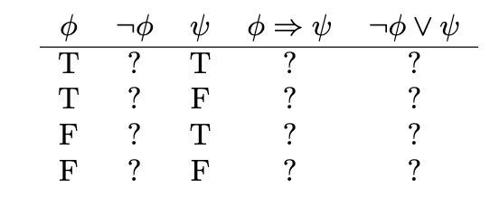
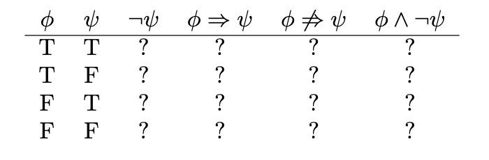

#### Q1. Let D be the statement "The dollar is strong", Y the statement "The Yuan is strong" and T the statement "New US–China trade agreement signed". Express the main content of each of the following (fictitious) newspaper headlines in logical notation. (Remember, logical notation capturestruth, but not the many nuances and inferences of natural language). As before, make sure you could justify and defend your answers.

(a) New trade agreement will lead to strong currencies in both countries.

(b) Strong Dollar means a weak Yuan

(c) Trade agreement fails on news of weak Dollar.

(d) If new trade agreement is signed, Dollar and Yuan can’t both remain strong

(e) Dollar weak but Yuan strong, following new trade agreement.

(f) If the trade agreement is signed, a rise in the Yuan will result in a fall in the Dollar.

(g) New trade agreement means Dollar and Yuan will rise and fall together.

(h) New trade agreement will be good for one side, but no one knows which.

A:

(a) T => (D ^ Y)

(b) D => ¬Y

(c) ¬Y => ¬T

(d) T => ¬(D ^ Y)

(e) (¬D ^ Y) => T

(f) T => (Y => ¬D)

(g) T => [(D ^ Y) v (¬D ^ ¬Y)]

(h) T => ¬(D ^ Y)

#### Q2. Complete the following truth table

(1) F, T, T

(2) F, F, F

(3) T, T, T

(4) T, T, T

#### Q3. What conclusions can you draw from the above table?

A:

(ϕ => ψ) = (¬ϕ v ψ)

#### Q4. Complete the following truth table

A:

(1) F, T, F, F

(2) T, F, T, T

(3) F, T, F, F

(4) T, T, F, F

#### Q5. What conclusions can you draw from the above table?

A:

¬(ϕ => ψ) = (ϕ ^ ¬ψ)
